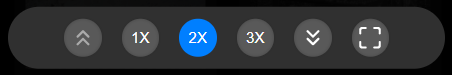

# Control bar

The Control Bar is a user interface element designed to regulate the behavior of the Grid component. It appears at the bottom of the component and offers several options for control. The following actions can be performed using the Control Bar:

- Change the sizes of the thumbnails
- Switch between Dark and Normal modes
- Go Full Screen
- Quickly navigate to the top or bottom of the Grid

The Control Bar is shown in the image below:

## Zoom controls

The Zoom controls enable users to adjust the size of the image thumbnails. The [imageSizes](../props.md#imagesizes) prop is utilized by the control to precisely modify thumbnail sizes.

## Fullscreen

The Fullscreen button enables users to switch between normal and fullscreen modes. In fullscreen mode, the component will occupy the entire screen's width and height. During the resizing operation, the grid is repainted, and recalculation is executed to display images in the best possible manner.

## Dark mode

The Dark mode button, described in [../props.md#enabledarkmode](../props.md#enabledarkmode), allows users to switch between normal and dark modes.

## Go to top or bottom

As the name implies, the Go to top or bottom buttons enable users to navigate rapidly to the top or bottom of the Grid.