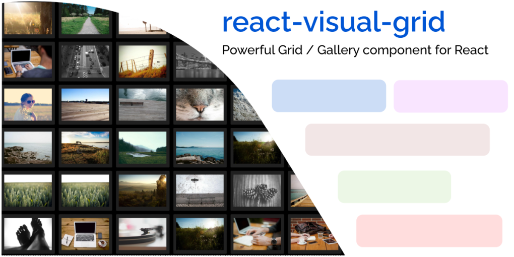

# Introduction

## What is react-visual-grid?

`react-visual-grid` is a TypeScript library designed to help you create visually stunning image grids in React. With this library, you can easily create grids that display images in an aesthetically pleasing and organized manner. 

## Why use react-visual-grid?

If you're building an application that needs to display a large number of images in a grid format, `react-visual-grid` is an excellent library to consider. Here are some reasons why:

- **Performance**: `react-visual-grid` is designed to be highly performant. With the built-in virtualization module, the library can efficiently load thousands of images without slowing down the browser.

- **Flexibility**: The library provides a lot of flexibility in terms of layout and customization options. You can choose between vertical and horizontal layouts and customize the look and feel of the grid using theming options.

- **Virtualization**: `react-visual-grid` uses virtualization to load images only when they become visible on the view port. This helps reduce the number of images that need to be loaded initially, which in turn helps with performance.

- **Masonry layout**: In addition to the standard grid layout, `react-visual-grid` also provides a masonry layout option. This layout option helps you create visually interesting grids with images of different sizes and aspect ratios.

- **Zoom modes**: `react-visual-grid` provides three unique zoom modes that enable you to control the size of the thumbnails. You can adjust the thumbnail sizes via the special control bar.