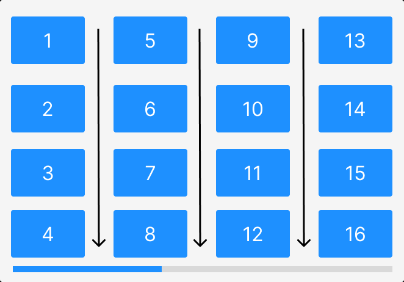

# Horizontal Layout

In a horizontal layout, there will be a fixed number of rows, and the number of columns will be decided based on the number of items in the list. The number of rows will be calculated based on the width of the list and the width of the item. The width of the item is calculated based on the height of the container and the gap settings.

The following image shows the horizontal layout with four rows and four columns.



```jsx title="Horizontal-Layout.jsx"
import { Grid } from "react-visual-grid";
import "react-visual-grid/dist/react-visual-grid.css";

const images = Array.from({ length: 20 }, (_, index) => ({
  src: `https://picsum.photos/id/${index+1}/800/600`,
  alt: `Image ${index + 1}`
}));

return (
  <div>
    <Grid
      images={images}
      width={800}
      height={600}
      gridLayout="HORIZONTAL"
    />
  </div>
);
```

The code is very similar to the vertical layout. The only difference is the `gridLayout` prop, which is now set to `HORIZONTAL`.

:::info
The `gridLayout` prop is case-sensitive. It should be either `HORIZONTAL` or `VERTICAL`.
:::

## CodeSandbox

<iframe src="https://codesandbox.io/embed/react-visual-grid-horizontal-e217ix?fontsize=14&hidenavigation=1&theme=dark&view=preview"
     title="react-visual-grid-horizontal"
     style={{width: '100%', height: '950px', border: 0, borderRadius: '4px', overflow: 'hidden'}}
     allow="accelerometer; ambient-light-sensor; camera; encrypted-media; geolocation; gyroscope; hid; microphone; midi; payment; usb; vr; xr-spatial-tracking"
     sandbox="allow-forms allow-modals allow-popups allow-presentation allow-same-origin allow-scripts"
   ></iframe>