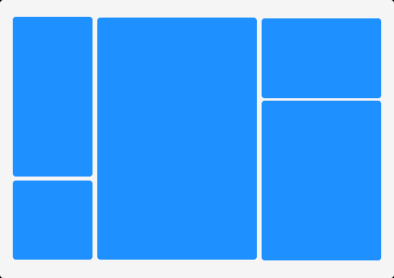

# Masonry

The Masonry layout is a useful technique that enables you to create a grid of images with varying widths and heights. Masonry comes with two fill-mode options to change the way the images are displayed.

There are two fill modes: `VERTICAL` and `HORIZONTAL`. When using `VERTICAL` fill mode, the images are placed from top to bottom. Once the boundary is reached, the next image will be rendered from the next column. Similarly, in the `HORIZONTAL` fill mode, the images are filled row by row, and once the boundary is reached, the next image will be placed from the next row.

To use the Masonry component, you must pass images as children and wrap them in either a span or div element. You should specify the width and height of the image as a class, naming your class using the format `rc-w-width` and `rc-h-height`.

Let's create a simple masonry grid with ten items to illustrate how to use the component. In this example, we will try to fill the images row by row. 

```jsx title="Masonry-Horizontal.jsx"
import { Masonry } from "react-visual-grid";

<Masonry fillMode="HORIZONTAL" height={1200} width={300}>
  <span className={`rc-w-100 rc-h-100`}>
    
  </span>
  <span className={`rc-w-200 rc-h-100`}>
    
  </span>
  <span className={`rc-w-200 rc-h-100`}>
    
  </span>
  <span className={`rc-w-100 rc-h-100`}>
    
  </span>
  <span className={`rc-w-300 rc-h-150`}>
    
  </span>
</Masonry>
```

The visual representation of how the masonry will look is shown below.


To fill the images vertically instead of horizontally, we can use the same images as above but with the `VERTICAL` fill mode.

```jsx title="Masonry-Vertical.jsx"
import { Masonry } from "react-visual-grid";

<Masonry fillMode="VERTICAL" height={300} width={600}>
  <span className={`rc-w-100 rc-h-100`}>
    
  </span>
  <span className={`rc-w-100 rc-h-200`}>
    
  </span>
  <span className={`rc-w-200 rc-h-300`}>
    
  </span>
  <span className={`rc-w-150 rc-h-100`}>
    
  </span>
  <span className={`rc-w-150 rc-h-200`}>
    
  </span>
</Masonry>
```

Here is the visual representation of how the masonry will look like for the above code.



> use the `gap` property to add spacing between the images.

## CodeSandBox

<iframe src="https://codesandbox.io/embed/react-visual-grid-masonry-c7x5ws?fontsize=14&hidenavigation=1&theme=dark&view=preview"
     style={{width:"100%", height:"600px", border:"0", borderRadius: "4px", overflow:"hidden"}}
     title="react-visual-grid-masonry"
     allow="accelerometer; ambient-light-sensor; camera; encrypted-media; geolocation; gyroscope; hid; microphone; midi; payment; usb; vr; xr-spatial-tracking"
     sandbox="allow-forms allow-modals allow-popups allow-presentation allow-same-origin allow-scripts"
   ></iframe>