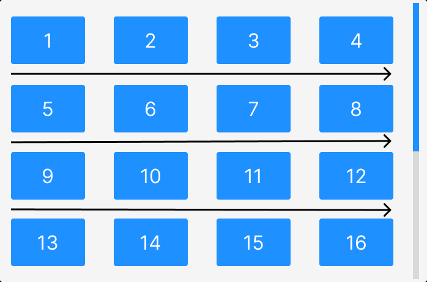

# Vertical layout

Vertical layout is the default layout of the Grid. This will have a fixed number of columns and a vertically scrollable grid container.
The number of columns is automatically calculated based on the width of the grid container and the gap settings specified.

The image below shows the vertical layout of the grid and the direction of the scroll.




Vertical layout is enabled by default, and this is specified through the `gridLayout` property of the grid.

:::info
The `gridLayout` property can be either set to `VERTICAL` or `HORIZONTAL`. `VERTICAL` is the default value.
:::

```jsx title="Vertical.jsx"
import { Grid } from "react-visual-grid";
import "react-visual-grid/dist/react-visual-grid.css";

const images = Array.from({ length: 20 }, (_, index) => ({
  src: `https://picsum.photos/id/${index+1})}/800/600`,
  alt: `Image ${i + 1}`
}));

return (
  <div>
    <Grid
      images={images}
      width={800}
      height={600}
      gridLayout="VERTICAL"
    />
  </div>
);
```


## CodeSandbox
<iframe src="https://codesandbox.io/embed/react-visual-grid-vertical-bn7yrf?fontsize=14&hidenavigation=1&theme=dark&view=preview"
     title="react-visual-grid-vertical"
     style={{width: '100%', height: '950px', border: 0, borderRadius: '4px', overflow: 'hidden'}}
     allow="accelerometer; ambient-light-sensor; camera; encrypted-media; geolocation; gyroscope; hid; microphone; midi; payment; usb; vr; xr-spatial-tracking"
     sandbox="allow-forms allow-modals allow-popups allow-presentation allow-same-origin allow-scripts"
   ></iframe>


In the next section, we will see how to use the horizontal layout of the grid.